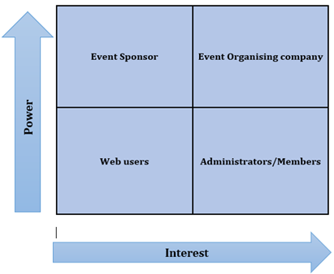
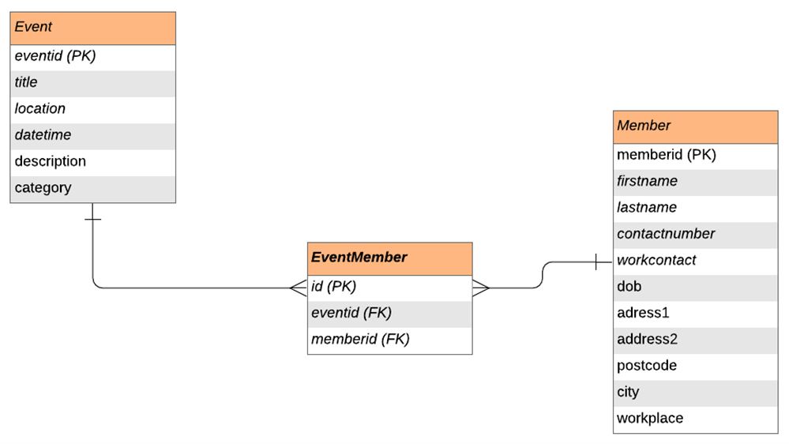
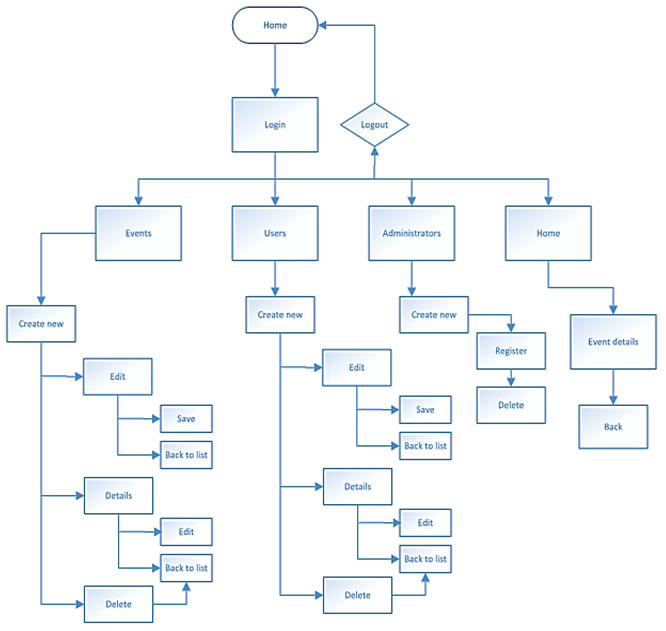

# Sports-Events-Viewer

.Net Platform 2020

## Techniques: 

- Requirements Analysis 
- Database Design 
- Web Design
  
## Introduction

In this project I build a web application using ASP .NET MVC core. This is an application that gets information from a backend database and provides two different levels of access to the users of the system. The database consists of users, events, administrators. The home page of the application can be accessed by any user but only the administrators can login to add, edit or delete an event or user. To login you will need the following credentials:

### Requirements Analysis

For this web application the requirements analysis was accomplished by identifying the stakeholders, functional and non-functional requirements. This helped to point out the features that are needed for the application.

#### Stakeholder Analysis

Stakeholder analysis is the process of outlining the users affected by the application, categorising them according to interest and influence then determining how best to communicate and include throughout the development of the application.

##### Power-Interest grid showing the stakeholders.

- Event Organising Company - High Power High Interest
This stakeholder’s continuous feedback will be required during the development process of the application because the product is designed for their needs and use. These are the most important stakeholders.

- Event Sponsors – High Power Low Interest
These stakeholders can give feedback about the application but have a low interest and will likely concentrate on the final product’s performance.

- Administrators/Members – Low Power High Interest 
These stakeholders need to be kept informed and be regularly monitored to ensure no problems with the application.

- Web users – Low Power Low Interest 
These stakeholders will just be kept informed periodically about the application’s progress.

#### Functional Requirements

* FR 001 - User must provide personal information such as name, date of birth, gender, email, address with valid postcode, personal contact, work contact and their work location.
* FR 002 - The home page must be accessible to all.
* FR 003 - Administrators must be able to log in for authorisation.
* FR 004 - Administrators must be able to add, edit or delete events from the database.
* FR 005 - Administrators should be able to register or delete members to the database as well as edit their personal information.
* FR 006 - Administrators should be able to modify information about list of events sports areas.

#### Non-Functional Requirements

* Security – Passwords are not visible when being entered or any other time. 
* Accessibility – Any user will  be able to view the home page with details of upcoming events but only administrators will be able to login into the system.
* Response times – The application will be able to respond to a user’s request in under 5 to 7 seconds.
  
### Database Design

The database design section includes an entity relationship diagram and the data tables with the variable names and data types used for the database in this web application.

#### Entity Relationship Diagram (UML Notation)

There is a one to many relationships between Event and EventMember entities.
There is a one to many relationships between Member and EventMember entities.
This means a member can be part of many events and an event can have one or more number of members. These are the entities used to create the classes found in the Models folder of the project which is used to manipulate and update the data entered in the database.

### Web Design

The application’s purpose is to provide online information about sports events for a sports events organising company. This information is displayed on the home page of the web application. The event information includes the event name, location, date, time, description and the category which outlines the event as either an indoor or outdoor event. Using bootstrap, the layout of the home page includes a navigation bar and the event details shown on cards. 

Administrators of the company can access the rest of the application by logging in using pre-registered credentials. The admin is required to enter an email and a password to log in. When logged in the admin can add new events to the database as well as edit or delete existing events. They can also add members to the database by entering their personal information. This information can be altered or removed from the database. The members and events appear to the administrator in a table on the respective index pages. Once members are added to the database, they can then be assigned to different events. 

Using the navigation bar, the admin can access any of the pages and complete the different tasks and actions by clicking on the various buttons and links added to the application.

When the administrator logs out of the application, they are returned to the home page.

The flowchart below outlines the web application structure showing the routes between pages that a user must take to complete their desired tasks. 

##### Structural diagram showing the navigation between pages on the application.

### Summary

The web application is done using Microsoft Visual Studio 2019, where the Asp .Net MVC framework is used to create the web application. The MVC framework separates the code components into models, views and controllers’ folders. The models folder contains all the data related logic which is used to interact with the database. The views folder is used for the user interface logic which for this application is the various tables, buttons and links. And then the controllers folder which works as an interface between the models and views to process all information requests and to interact with the views to provide the final application.

### References

- Airtable-Support. 2020. A Beginner's Guide To Many-To-Many Relationships. [online] Available at: <https://support.airtable.com> [Accessed 29 March 2020].

- Guru99.com. 2020. What Is A Functional Requirement? Specification, Types, EXAMPLES. [online] Available at: <https://www.guru99.com> [Accessed 29 March 2020].

- Productplan.com. 2020. What Is Stakeholder Analysis? | Definition And Overview. [online] Available at: <https://www.productplan.com> [Accessed 29 March 2020].